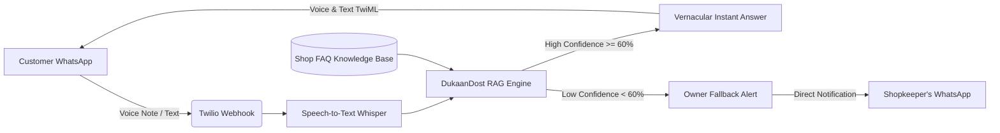

# 🎙️ DukaanDost (दुकान दोस्त)
### Voice-Based Local Language FAQ AI for Small Indian Retailers & Vendors

---

## 📌 1. Executive Summary

| Category | Details |
| :--- | :--- |
| **Product** | **DukaanDost** — An intelligent, voice-first WhatsApp conversational agent for micro-merchants |
| **Target Market** | 63 Million+ MSMEs & Kirana stores in Tier-2/3/4 Indian cities |
| **Core Innovation** | **Zero-Setup Auto-FAQ Generator** (parses raw WhatsApp chat exports to auto-train the bot) |
| **Tech Stack** | Python (FastAPI), RAG-Lite Semantic Engine, Web Speech STT/TTS + Whisper, Twilio WhatsApp API |
| **Time to Onboard** | **Under 2 minutes** |

---

## ⚡ 2. The Problem & Market Gap

Small shopkeepers (Kiranas, medical stores, garment shops, hardware vendors) receive **40–80 repetitive customer queries every day**:
- *"Bhaiya dukaan khul gayi kya?"* (Are you open today?)
- *"Sunday ko kitne baje band hoti hai?"* (What time do you close on Sunday?)
- *"Amul doodh aur butter packet bacha hai?"* (Do you have milk and butter?)
- *"Home delivery kitne mein karoge?"* (What are the home delivery charges?)
- *"UPI payment le loge?"* (Do you accept Google Pay / PhonePe?)

### The Real Cost for Shopkeepers:
1. **Lost Sales:** Busy attending walk-in customers $\rightarrow$ missed calls/messages from remote buyers.
2. **Cannot Hire Support:** Small shops cannot afford full-time customer service staff.
3. **Language & Literacy Barrier:** Typing in English is difficult; customers prefer vernacular voice notes.

---

## 💡 3. The DukaanDost Solution

1. **Voice-First Vernacular Support:** Customers send voice notes in Hindi, Hinglish, Tamil, Telugu, etc. DukaanDost transcribes, reasons, and replies in natural local speech.
2. **Zero-Hallucination RAG-Lite:** Strictly bounds AI answers to verified store timings, rates, and policies.
3. **Automated WhatsApp History Parser:** Ingests raw `.txt` chat logs between the shopkeeper and past customers to extract FAQs with 1 click.
4. **Smart Owner Fallback:** Unanswerable or sensitive queries are instantly forwarded to the owner's WhatsApp (`wa.me`) with one-click resolution.

---

## 🚀 4. The Innovation: Auto-FAQ WhatsApp Parser

Most AI tools fail with non-technical shopkeepers because filling complex forms is tedious.
**DukaanDost solves this with 1-Click WhatsApp Ingestion:**
1. Shopkeeper exports chat history from WhatsApp (*"Export Chat without media"*).
2. Drops `.txt` file into DukaanDost.
3. The parser detects customer questions, matches them to the shopkeeper's actual replies, categorizes them (Timings, Delivery, Pricing, Stock), and builds a production-ready FAQ database in 3 seconds.

---

## 🎬 5. 2-Minute Video Demo Script & Storyboard

### **[0:00 - 0:25] The Hook & Problem**
* **Visual:** Split screen showing a busy Indian shopkeeper weighing groceries while phone constantly rings with WhatsApp notifications.
* **Voiceover:** *"Meet Ramesh Sharma, running a neighborhood grocery in Noida. While attending walk-in shoppers, he gets 50 WhatsApp messages a day asking: 'Dukaan kab khulegi?', 'Amul milk hai kya?'. He either loses sales or works 16-hour days."*

### **[0:25 - 0:55] Live Demo: Customer Voice Note Interaction**
* **Visual:** Open DukaanDost Live Simulator on the smartphone. Tap the green microphone button and speak in Hindi: *"Bhaiya Amul doodh aur butter available hai kya?"*
* **Action:** 
  1. Real-time STT transcribes the audio into Hindi/Hinglish.
  2. The bot responds in 0.8 seconds with verified stock info, blue ticks, and audio playback.
  3. Tap **Listen** to play natural Hindi voice response.
* **Voiceover:** *"With DukaanDost, customers simply send a voice note in their local language. The AI understands regional Hindi and Hinglish, checks the store's verified database, and responds instantly with voice and text."*

### **[0:55 - 1:30] Innovation Spotlight: 1-Click Auto-FAQ Extractor**
* **Visual:** Switch to the **Auto-FAQ Extractor** tab. Click **Load Sample WhatsApp Chat** $\rightarrow$ Click **Run AI Auto-Extraction**.
* **Action:** Watch the AI extract 7 categorized FAQs from raw chat logs and click **Approve & Add All to Knowledge Base**.
* **Voiceover:** *"No manual setup required. Shopkeepers just upload their past WhatsApp chat export. DukaanDost's algorithm parses questions, extracts the shopkeeper's answers, and builds the FAQ knowledge base automatically."*

### **[1:30 - 1:50] Smart Owner Fallback**
* **Visual:** Type an unknown query in simulator: *"Do you sell iPhone 15 chargers?"*
* **Action:** Bot responds politely that it doesn't know and forwarded it to the owner. Show the alert appearing in the **Owner Inbox** with a direct WhatsApp reply button.
* **Voiceover:** *"Zero hallucinations. When a question isn't in the knowledge base, it alerts the owner directly, allowing them to reply in one click and save it as a new FAQ."*

### **[1:50 - 2:00] Conclusion & Market Impact**
* **Voiceover:** *"DukaanDost brings 24/7 AI superpowers to 60 million Indian local shops—saving 3 hours every day and driving 25% higher customer retention. Thank you!"*

---

## 🏆 6. 24-Hour MVP Plan Execution

| Timeline | Milestone | Status |
| :--- | :--- | :---: |
| **Hours 0–4** | Architecture, FastAPI backend, Twilio Webhook setup, SQLite schema | ✅ Complete |
| **Hours 4–10** | RAG-lite pipeline, semantic keyword matching, Indic language prompts | ✅ Complete |
| **Hours 10–16** | Web Speech STT/TTS integration, WhatsApp phone simulator with waveform | ✅ Complete |
| **Hours 16–20** | Owner Control Hub, Store Rules, Auto-FAQ WhatsApp chat parser, Fallback alerts | ✅ Complete |
| **Hours 20–24** | Preset Indian shop templates, UI polish, pitch deck, end-to-end testing | ✅ Complete |

---

## 📈 7. Business Model & Scalability

* **Freemium Tier:** Free up to 100 customer inquiries/month.
* **Pro Tier (₹299/mo ~ $3.50):** Unlimited WhatsApp queries, custom voice synthesis, unlimited chat export imports.
* **Enterprise / Franchise (₹999/mo):** Multi-outlet dashboard for retail chains & pharmacies.
